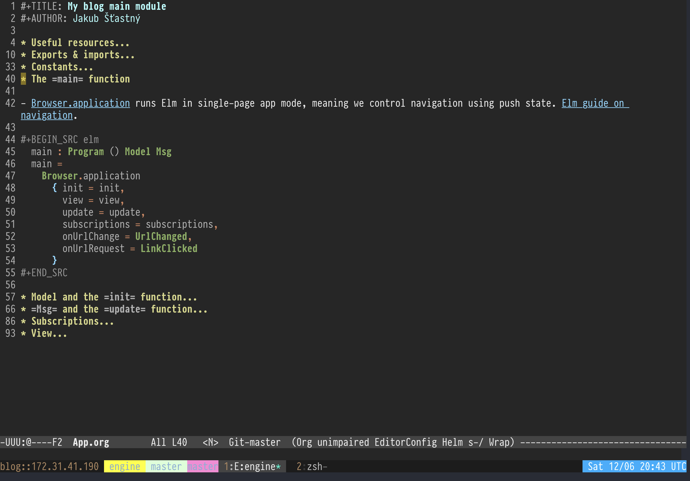

<!--
  Unlike in other repos, README in Org mode format is not supported here.
-->

I'm a semi-retired software developer, blogger, [illustrator](https://www.instagram.com/jakub.stastny.pt) and gardener. Let's talk life?

# My tools of choice

- Elm for the web, Common Lisp or Haskell for anything else.
- Emacs in EVIL mode.
- Org mode for everything, including code (literate programming).
- iPad Pro 11", Blink, Mosh & ZSH. Ubuntu VPS.
- Scriptable for writing iPadOS widgets.
- Apple Pencil & Procreate for illustrations.

## Here is how I like to work:

Literate programming in Org mode, yes please!

# Contact

Please use [GitHub discussions](https://github.com/jakub-stastny/jakub-stastny/discussions) on this repository. I will provide a way to contact me directly once I launch [my blog](https://github.com/jakub-stastny/blog), but in the meantime, please, use the discussions. Cheers!

# Available for hire?

Potentially. If you have an interesting project you think I'd like, [get in touch](https://github.com/jakub-stastny/jakub-stastny/discussions).

<!--drop me a line: link my form submit-->

I'm interesting in any functional programming language or Lisp.

Just keep in mind that:

- I live in Mexico and I'm not interested in relocation.
- I'm not interested in a job. Project, maybe. Job, no.

# Available for colaboration?

If you have a cool project and are looking for colaborators, I might be open to it – especially if it's something for iPadOS, which is where a lot of my interest lies these days.
